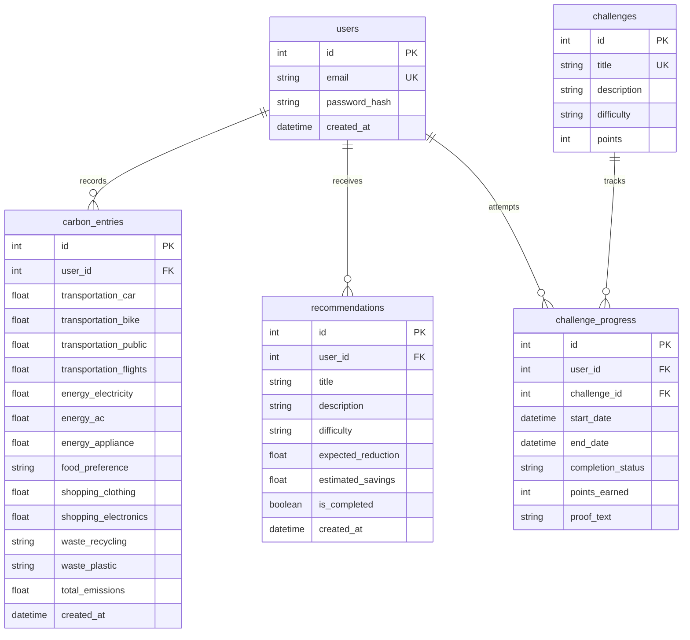

# EcoTrack AI - Carbon Footprint Tracker & Recommendations Engine

EcoTrack AI is a premium, full-stack application designed to help individuals calculate, analyze, and reduce their carbon footprint. The application features user authentication, a carbon footprint calculation wizard, data analytics (with historical tracking and averages comparison), gamified eco-challenges with verification proofs, and a dynamic sustainability recommendation engine.

---

## 🏗️ Technical Stack & Architecture

### Frontend
- **HTML5 & Semantic Markup**: Structured for SEO optimization and accessibility standards.
- **CSS3 Styling & Themes**: Built using a modern CSS design system with HSL variables, smooth transitions, CSS grids, and responsive layouts. Includes complete support for HSL-based Light and Dark modes.
- **Vanilla JavaScript**: Lightweight client-side application logic, featuring:
  - Custom router with state-preserving page navigation (`navigateTo`).
  - Modular API helper `API.request` injecting security tokens dynamically.
  - Interactive charts utilizing SVG and Canvas APIs (line history chart, national average comparison chart).
  - Keyboard focus trap within the footprint wizard steps.

### Backend
- **Python 3.11 & Flask**: Lightweight, robust WSGI framework serving both RESTful JSON API endpoints and static assets.
- **Flask-SQLAlchemy**: ORM for structured database operations on SQLite (local / testing) and PostgreSQL (production connection pooling).
- **Flask-Migrate (Alembic)**: Versioned database migration management.
- **Bcrypt**: Cryptographic password hashing (`hashpw` / `checkpw`) ensuring secure user registration.
- **Itsdangerous**: Secure cryptographic timed token serialization (`URLSafeTimedSerializer`) for session validation.
- **In-Memory Rate Limiting**: Implemented using a sliding window rate-limiter on critical authentication endpoints to prevent brute-force attacks.

### External Services
- **Google Gemini API**: Generates advanced, contextual, and tailormade carbon reduction suggestions. If unconfigured or missing a key, the backend seamlessly falls back to a deterministic rules-based generator mapped to the user's highest footprint categories.

---

## 📂 Project Directory Structure

```text
CFAP/
├── backend/
│   ├── routes/
│   │   ├── __init__.py
│   │   ├── analytics.py        # Analytics history (3m, 6m, ytd), breakdown, averages
│   │   ├── auth.py             # User signup, login, session validation & rate-limiting
│   │   ├── calculator.py       # Emissions submission logic & sanitization checks
│   │   ├── challenges.py       # Joining, rules parsing, and completing challenges with proof
│   │   └── recommendations.py  # Recommendations fetching (Gemini AI or rules engine)
│   ├── services/
│   │   └── gemini_service.py   # Google Gemini API connector & rules-based fallback
│   ├── app.py                  # Flask application factory, migrations, & custom CLI
│   ├── config.py               # Environment configuration profiles (Dev, Test, Prod)
│   ├── constants.py            # Centralized carbon emission factors & conversion tables
│   └── models.py               # SQLAlchemy database models
├── frontend/
│   ├── css/
│   │   └── style.css           # Premium HSL themes, grid systems, and layout styling
│   ├── js/
│   │   └── app.js              # State engine, focus-trap, rendering, and API fetch client
│   └── index.html              # Accessibility-compliant structure & layout container
├── instance/                   # Local instance database location
├── migrations/                 # Alembic database versioning scripts
├── tests/
│   └── test_app.py             # Pytest automated verification suite
├── run.py                      # App server entrypoint script
├── requirements.txt            # Python environment dependencies
└── .gitignore                  # Ignored runtime states, keys, and SQLite DB files
```

---

## 🗄️ Database Schemas & Models

The system architecture defines five relational database tables inside [backend/models.py](file:///c:/Users/ARAVPALSULE/OneDrive/Desktop/CFAP/backend/models.py):



---

## ⚙️ Core Technical Modules

### 1. Authentication & Security
- **Dynamic Timed Tokens**: Done via `URLSafeTimedSerializer` with a duration check of 24 hours. Tokens are stored client-side in `localStorage` and sent inside the `Authorization: Bearer <token>` header on protected API calls.
- **In-Memory Rate Limiting**: The `@rate_limit` decorator monitors incoming request IP addresses. Endpoint calls are limited to `5 requests per minute` per client IP. Any violations receive a `429 Too Many Requests` status.
- **Password Protection**: Plaintext passwords are never saved. Hashing is performed using `bcrypt` and verified using `bcrypt.checkpw`.

### 2. Footprint Calculator & Centralized Constants
- Centralized conversion constants are defined inside [backend/constants.py](file:///c:/Users/ARAVPALSULE/OneDrive/Desktop/CFAP/backend/constants.py) to prevent hardcoding.
- Input validation sanitizes all parameters, rejecting negative numerical values with a `400 Bad Request` exception.

### 3. Advanced Analytics & Charts
- **History Duration Slices**: Supported filter modes inside [backend/routes/analytics.py](file:///c:/Users/ARAVPALSULE/OneDrive/Desktop/CFAP/backend/routes/analytics.py):
  - `3m`: Slices history to the last 3 entries.
  - `6m`: Slices history to the last 6 entries.
  - `ytd`: Filters entries with timestamps greater than or equal to January 1st of the current year.
- **Comparison Visualizations**: Draws dynamic bar comparison elements comparing user footprint against the European national average (1,300 kg) and the global target average (350 kg).
- **Absolute Value Tooltips**: Chart breakdowns map category percentages alongside raw emissions in kilograms.

### 4. Eco-Challenges & Gamification
- **Proof-of-Completion**: Complete challenge requests (`/api/challenges/<progress_id>/complete`) collect a `proof_text` field. This text field is stored in the database as auditable proof of completion.
- **Step-by-Step Rules Modals**: Frontend modals parse double-dash lists from the challenge descriptions to dynamically render rules and tracking habits.

### 5. Infrastructure & Configuration Profiles
- Supports modular inheritance structures in [backend/config.py](file:///c:/Users/ARAVPALSULE/OneDrive/Desktop/CFAP/backend/config.py):
  - **DevelopmentConfig**: Default configuration using a local SQLite instance (`ecotrack.db`) and debugging parameters enabled.
  - **TestingConfig**: In-memory database configuration mapping (`sqlite:///:memory:`) with testing assertions enabled.
  - **ProductionConfig**: Production configuration optimized for PostgreSQL / Supabase, carrying custom connection pool options (`pool_size=10`, `max_overflow=20`, `pool_recycle=1800`, `pool_pre_ping=True`).
- **Backup Command CLI**: Run `flask db-backup` to automatically run a timestamped JSON backup of all footprint entries inside `backups/backup_YYYYMMDD_HHMMSS.json`.

---

## 🚀 Installation & Local Startup

### 1. Prerequisite Installations
Ensure Python 3.11+ is installed. Clone the repository and navigate into the root directory.

### 2. Configure Virtual Environment & Dependencies
Initialize and activate a virtual environment, then install requirements:
```bash
# Using Python venv
python -m venv backend/.venv
backend\.venv\Scripts\activate

# Install requirements
pip install -r requirements.txt
```

### 3. Configure Environment Variables
Create a `.env` file in the project root based on `.env.example`:
```ini
SECRET_KEY=your_cryptographic_secret_session_key
DATABASE_URL=sqlite:///ecotrack.db
GEMINI_API_KEY=your_optional_gemini_api_key
```

### 4. Database Setup & Upgrades
Initialize database schemas and apply existing Alembic migration versions:
```bash
set FLASK_APP=backend.app:create_app
flask db upgrade
```

### 5. Start Application Server
Start the Flask local development server:
```bash
python run.py
```
Open [http://127.0.0.1:8000](http://127.0.0.1:8000) inside your web browser. The application serves both the API routes and static frontend elements from the server.

---

## 🧪 Automated Verification & Testing

### Running Unit Tests
A comprehensive test suite is located inside [tests/test_app.py](file:///c:/Users/ARAVPALSULE/OneDrive/Desktop/CFAP/tests/test_app.py). Execute tests using:
```bash
backend/.venv/Scripts/python -m pytest
```

The test coverage validates:
1. Calculator values correctness.
2. Form negative values rejection.
3. Fallback engine rules routing.
4. Active challenges flow & `proof_text` storage.
5. User registration & login success.
6. Unique constraint duplicate email checks.
7. Password length validations.
8. Timed auth headers session protection.
9. Rate-limiter (429 status code blocks).
10. History line chart filtering duration slices (`3m`, `6m`, `ytd`).
11. Config profile settings validations (`TestingConfig`, `DevelopmentConfig`, `ProductionConfig`).
